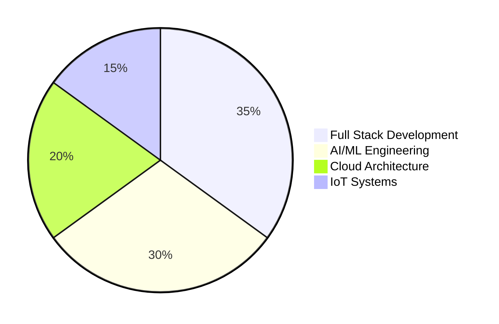

I understand you want more impressive visual elements and less of the standard GitHub stats graphs. Here's an updated version with more show-off worthy visualizations:

---

<h1 align="center">
  
</h1>

  

  

  
  
  

---

## 👨‍💻 About Me

  

I'm a **Computer Science Engineer** who turns coffee into scalable systems. I've led teams, built IoT platforms from scratch, and pushed AI models to production. Currently obsessed with **GenAI**, **Edge Computing**, and **System Design**.

- 🎯 **TCS CodeVita 2025**: AIR 4900+ (Top 5% nationally)
- 🏆 **TechSynergy IoT Showcase**: 2nd Place Winner
- ⭐ **5/5 Rating** - Outstanding Performance Recognition
- 🎖️ **Intern of the Month** Awardee
- 🤝 **4 Accepted PRs** - Hacktoberfest 2024

---

## 📈 Performance Metrics & Achievements

  <table>
    <tr>
      <td align="center">
        
      </td>
      <td align="center">
        
      </td>
    </tr>
    <tr>
      <td colspan="2" align="center">
        
      </td>
    </tr>
  </table>

---

## 🎯 Key Achievements Dashboard

  <table>
    <tr>
      <td align="center">
        <h3>📊 Code Rankings</h3>
        
      </td>
      <td align="center">
        <h3>🏆 Trophies</h3>
        
      </td>
    </tr>
  </table>

---

## 🚀 Impact Metrics

  <table>
    <tr>
      <td align="center">
        
        
API Latency Reduction

      </td>
      <td align="center">
        
        
AI Defect Detection

      </td>
      <td align="center">
        
        
Organic Traffic Growth

      </td>
      <td align="center">
        
        
Search Ranking Improvement

      </td>
    </tr>
  </table>

---

## 📈 Contribution Activity

  

---

## 🛠️ Tech Stack Mastery

  

---

## 🎯 Skills Radar

  <table>
    <tr>
      <td align="center">
        
      </td>
      <td align="center">
        
      </td>
    </tr>
  </table>

---

## 🔥 Recent Achievements

  <table>
    <tr>
      <td>🏆 <b>TCS CodeVita Round 2</b> - AIR 4905</td>
      <td>🎖️ <b>3-Time College Coding Topper</b> - Code360</td>
    </tr>
    <tr>
      <td>🥈 <b>TechSynergy IoT Showcase</b> - 2nd Place</td>
      <td>⭐ <b>5/5 Rating</b> - Internship Excellence</td>
    </tr>
    <tr>
      <td>🏅 <b>Intern of the Month</b> - Ouranos Robotics</td>
      <td>🤝 <b>4 PRs Merged</b> - Hacktoberfest 2024</td>
    </tr>
  </table>

---

## 📊 Weekly Development Breakdown

  

---

## 🎯 Current Focus

---

## 🌟 Featured Projects Impact

  <table>
    <tr>
      <th>Project</th>
      <th>Impact</th>
      <th>Tech Stack</th>
    </tr>
    <tr>
      <td>IoT Monitoring Platform</td>
      <td>📈 40% Latency Reduction</td>
      <td>React, Node.js, MQTT, Redis</td>
    </tr>
    <tr>
      <td>AI Defect Detection</td>
      <td>🎯 95% Accuracy</td>
      <td>YOLOv8, OpenCV, Python</td>
    </tr>
    <tr>
      <td>Digital Transformation</td>
      <td>🚀 30% Traffic Increase</td>
      <td>Next.js, Tailwind, SEO</td>
    </tr>
    <tr>
      <td>Cloud DBMS Platform</td>
      <td>🔒 Secure RBAC Implementation</td>
      <td>PERN Stack, NeonDB</td>
    </tr>
  </table>

---

## 📫 Connect With Me

  

---

  

---

  
### 💡 *"Code. Create. Conquer."*

⭐️ **Star this repo if you like what you see!** ⭐️

